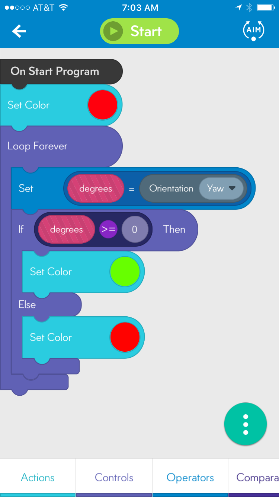

## Degrees

This code demonstrates the IF, THEN, ELSE statement as well as the use of variables and sensors. This code should be introduced only after the students are familiar with the SPRK (Integrated Development Environment) IDE and have executed the simple ChangeColor program.

### Behavior

When executed the robot will turn green when faced to the right and red when faced to the left. The program executes continuously until stopped from the IDE.

### IF, THEN, ELSE

This statement allows the program to check for a condition to see if it is present or not (TRUE or FALSE) and execute a command based on the outcome of the check. Example,

	x = 0

	IF (x == 0) {
		print ("Hello")
	}
	ELSE {
		print ("Goodbye")
	}

In the pseudo code above the variable x is set to 0. The IF checks to see if x is 0 which it is so the statement returns TRUE. Since the statement is true the code will print "Hello" (THEN is implied here). The ELSE condition is ignored because the statement is not false.

### Code

### Orientation

This code uses the Orientation Sensor which can return a value for Pitch, Roll, or Yaw. In this case we're returning the sensor value for Yaw which can be any value between -180 and 180. You can imagine that 0 is the value that is returned when the robot is facing directly ahead. If the robot is turned to the left it will return a negative value. Facing the robot to the right will return a positive value. This value is assigned to the variable *degrees*.
