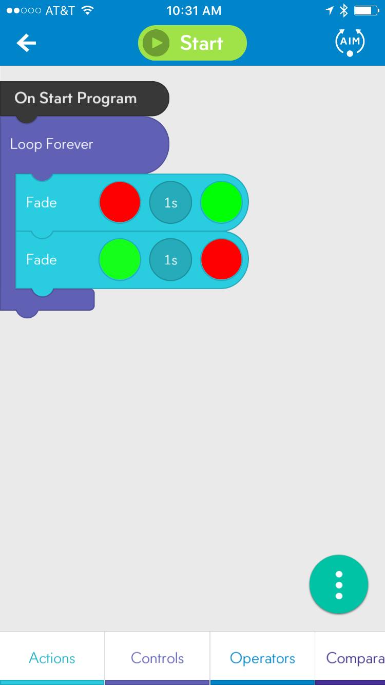

##Light Show

This application extends the first lesson by providing opportunities to work with a more advanced command block, Fade. It also introduces the concept of loops.

###Behavior

This program will cycle through the color wheel creating a little "light show".

### Code

###Loops

Loops are control structures that allow a program to repeat itself multiple times. Loops can either run forever, run until some condition is met (e.g. some time has passed or some sensor triggered), or run for a specific number of iterations. In this program, we use the loop forever control structure which means the program will run until the student stops it (or the robot runs out of power).

###Key Lesson

Loops are an important part of most programming languages. Without them, many of the complex behaviors would be very onerous or impossible to program. When following up with the students, ask them to think about what it would take to get the same behavior to run for an hour if they couldn't use a loop.
