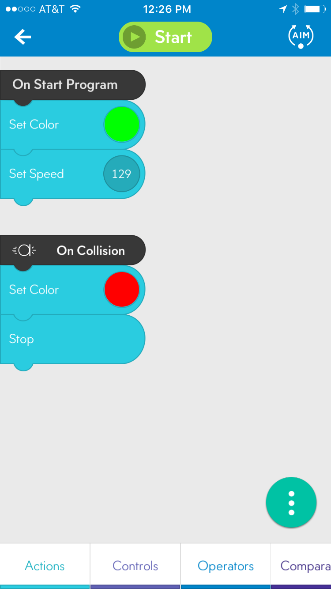

## Obstacle Management

This code demonstrates EVENTS and their use in creating  behavior. Older student may appreciate a small introduction to the concept of threads and multi-threaded application development but it is not needed for this exercise.

### Behavior

When executed the robot will turn the on-board LED green and start to move forward. In the event of a collision the robot will turn red and come to a full stop.

### Code

### Events

In the SPRK Lightning Lab IDE there are four predefined events. These are,

*	On Collision - Conditional logic performed when the robot collides with an object.
*	On Freefall - Conditional logic performed when the robot falls through the air, defined by an accelerometer reading of < 0.1 G for a duration of >= 0.1 seconds. (Remember the 1 G is resting.)
*	On Land - Conditional logic performed when the robot lands after an On Freefall event.
*	On Gyro Max - Conditional logic performed when the robot reaches the upper limit of rotational velocity. Gyro Max can be triggered by spinning the robot extremely fast.

This application uses the On Collision event. On Collision defines the logic to follow when a collision is detected. In our application, that code sets the color of the on-board LED to red and calls the stop action.
